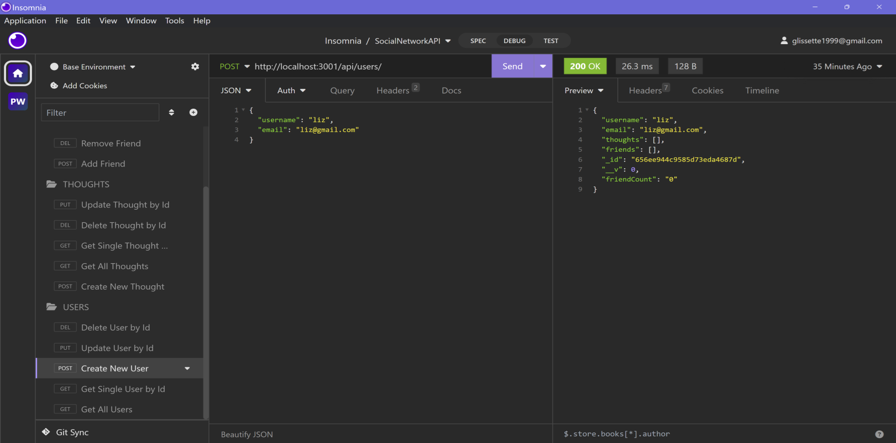

# challenge16-SocialNetwork

## Description
In this challenge I will be demonstrating my knowledge on refactoring a code by rerouting routes using Express.js, renaming models and their entries based on what information we are saving from the user, making sure my CRUD is up to standard, and the database in MongoDB is responsinve. I will be building an API where the user can share their thoughts, react to friends’ thoughts, and create a friend list. 
## Installation
<ol>
    <li>Create Repository on Github</li>
    <li>Clone Repository to Computer and open in VS Code</li>
    <li>Install Node Modules</li>
    <li>Rename models and change data entries</li>
    <li>Change CRUD in controllers and rename</li>
    <li>Rename CRUD requests in the routes to line up wtih controllers and insomnia</li>
    <li>Test database in terminal using npm start</li>
    <li>Create CRUD in insomnia and test code</li>
    <li>Create READNE.md</li>
    <li>Record video Demonstration</li>
    <li>Submit Github link and Video demo link</li>
</ol>

## Usage

Link to github: <a href="https://github.com/bizwliz/Challenge16-SocialNetwork">Challenge 16 Social Network</a>

Video Demonstration (Please click on picture for video link to deploy):

## License
 

## Tests
Tested using VS Code.
Tested Using Insomia.